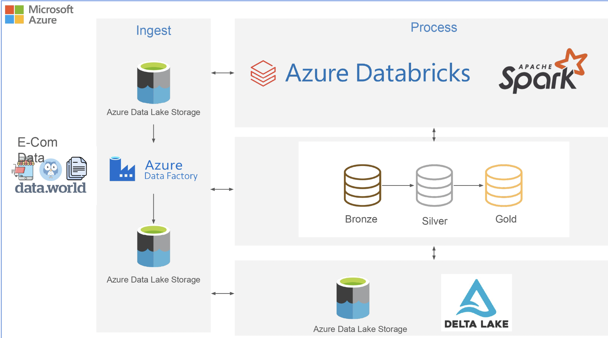

# Ecommerce Datapipeline with Azure and Databricks
## Overview
This project is a real-time data pipeline designed to ingest, process, store, and visualize e-commerce data efficiently using Azure Cloud services. The pipeline ensures scalability, automation, and high performance for data-driven decision-making.

## Project Objective
The goal of this project is to automate the processing of e-commerce sales data from multiple sources (such as transactional databases, APIs, and CSV files), transform it into structured datasets, and store it in a cloud-based data warehouse (Snowflake/Azure Synapse) for analytics and business intelligence.
This project follows a modern data pipeline architecture, ensuring:
- Efficient data ingestion using Azure Data Factory (ADF)
- Robust ETL processing using Azure Databricks (Apache Spark)
- Organized data storage using Azure Data Lake (ADLS)
- Optimized querying using Snowflake/Azure Synapse
- Data visualization & analytics using Power BI or Tableau

## Architecture Overview

### Data Sources (Raw Data Ingestion)
E-commerce platform sales data is collected from CSV files stored in Blob Storage. Data is structured (CSV, JSON) and semi-structured (logs, XML).

### Data Ingestion Using Azure Data Factory (ADF)
The Azure Data Factory (ADF) pipeline automates the ingestion, transformation, and storage of e-commerce data using triggers and pipelines. Initially, raw CSV data is extracted from a PC and stored in Landing Zone 1 within Azure Data Lake Storage (ADLS). Using scheduled triggers, ADF pipelines copy and transform the data, converting it from CSV to Parquet, and store it in Landing Zone 2 for optimized processing. The data is then processed through Databricks notebooks, following the Bronze → Silver → Gold transformation stages, ensuring data is cleaned, structured, and enriched for analytics. Finally, SQL queries in Databricks analyze the refined Gold layer data, enabling efficient querying and reporting within the Azure Cloud environment.
These operations are orchestrated using event-based and scheduled triggers, ensuring that new data is processed as soon as it arrives or at predefined intervals.

### Data Processing & Transformation Using Azure Databricks (ETL)
- Azure Databricks (Apache Spark) processes the raw data and puta it in the bronze layer.!Bronze Layer = unprocessed raw data!
- Later cleans missing values, handles duplicates.
- Converts timestamps, normalizes customer/product data.
- Joins tables to enrich sales records with customer & product details.
- Transformed data is stored back in Azure Data Lake (Silver Layer).
!Silver Layer = Cleaned and enriched data!
- Read cleaned data from the Silver Layer; aggregate, join, and optimize for business insights.
- Transformed data is stored back in Azure Data Lake (Gold Layer).
!Gold Layer = aggregated and denormalized data!

### SQL-Based Analysis & Visualization
After data is processed and stored in the Gold Layer, Databricks SQL and Power BI is used for analytics and visualization. SQL queries extract insights directly from Delta Tables in Databricks.

Power BI Dashboard

