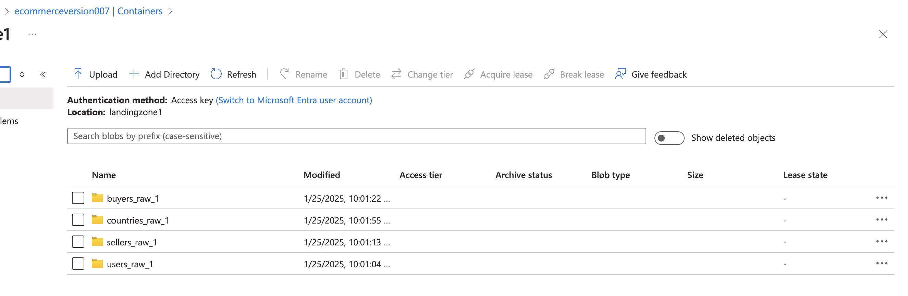
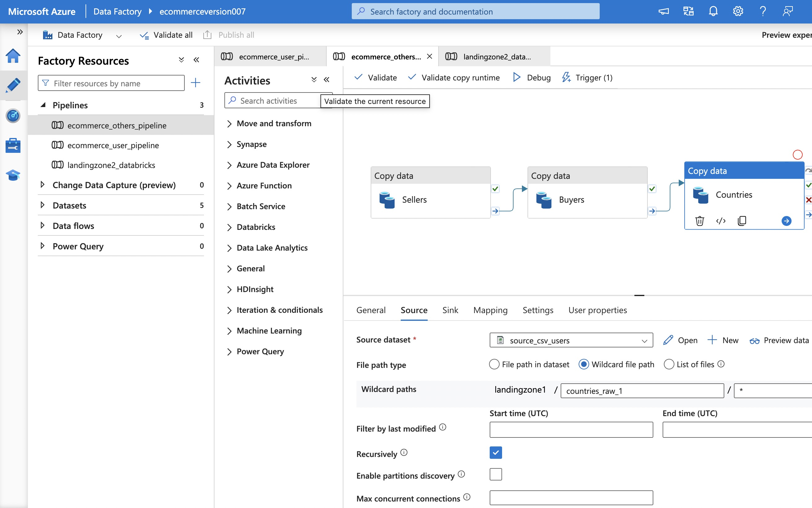

# 🚀 Azure E-Commerce Data Pipeline

This project implements an end-to-end **E-commerce Data Pipeline** using **Azure Storage, Azure Data Factory (ADF), Databricks, and Power BI**. The pipeline ingests, processes, and analyzes user, seller, buyer, and country data efficiently using **bronze, silver, and gold layers** (**medallion architecture**) for data transformation. 

## 📂 Data Sources and Structure

The pipeline handles four key datasets:

- **Sellers, Buyers, and Countries**: These are **static** tables with minimal updates.
- **Users**: **Dynamic** tables that get generated frequently and is **partitioned into 5 chunks** before processing using the "Chunk_data.ipynb" file in the repository.
The raw data is stored in **Azure Data Lake Storage (ADLS)** in a **Landing Zone 1**.

## 📤 Data Ingestion with Azure Data Factory (ADF)

### 1️⃣ **Data Movement Pipelines**
- **Sellers, Buyers, and Countries**: A **single ADF pipeline** extracts CSV files, converts them to **Parquet**, and stores them in **Landing Zone 2**.

- **Users Data**: A **separate ADF pipeline** processes user chunks since it updates frequently.

### 2️⃣ **Automated Triggers**
- **Sellers, Buyers, Countries** → **Scheduled** trigger for periodic execution.
- **Users Data** → **Event-based** trigger, executing when a new file is uploaded.

The transformed data is stored in **Landing Zone 2**:

## 🛠 Data Processing with Databricks

### 1️⃣ **Trigger-Driven Bronze-Silver-Gold Pipeline**
- A **trigger in ADF** is set up to **initiate the Bronze-Silver-Gold pipeline whenever new data is added to Landing Zone 2**.
- The data pipeline follows **medallion architecture**:

  - **Bronze Layer** → Raw Parquet files stored as **Delta Tables**.
  - **Silver Layer** → Cleaned and structured tables.
  - **Gold Layer** → Aggregated as one table data for analysis.

🔹 *Bronze → Silver → Gold Pipeline*

### 2️⃣ **Gold Layer (Final Aggregated Data)**
- The **final Gold Table** is a **combination of all the tables** (Users, Sellers, Buyers, Countries) optimized for analytics.

### Trigger for each pipeline: ###

---

## 📊 Data Analysis & Visualization in Power BI

- **SQL transformations** were performed in Databricks to **generate analytical insights**.
- **Gold tables** were used for **business intelligence reporting** in **Power BI**.
- **Created an interactive Power BI dashboard** by connecting Databricks and PowerBI(using delta silver tables coverted to sql tables in databricks) to visualize user behavior, trends, and other insights.

🔹 *Final Power BI Dashboard*

You can download the dashboard in the repository named as "ecommerce.pbix".

---

## 🎯 Key Features
✔ **Automated data ingestion** with Azure Data Factory  
✔ **Trigger-based Bronze-Silver-Gold execution**  
✔ **Delta Lake storage optimization** using Bronze, Silver, and Gold layers  
✔ **Databricks-powered ETL** for structured transformations  
✔ **Power BI analytics** for business insights  

---

## 🚀 Technologies Used
- **Azure Data Factory (ADF)** - Data ingestion and movement  
- **Azure Data Lake Storage (ADLS)** - Data storage and structuring  
- **Databricks(Apache Spark) + Delta Lake** - ETL processing and storage  
- **Power BI** - Data visualization
- **Azure Data Lake (ADLS)** - Organized data storage

